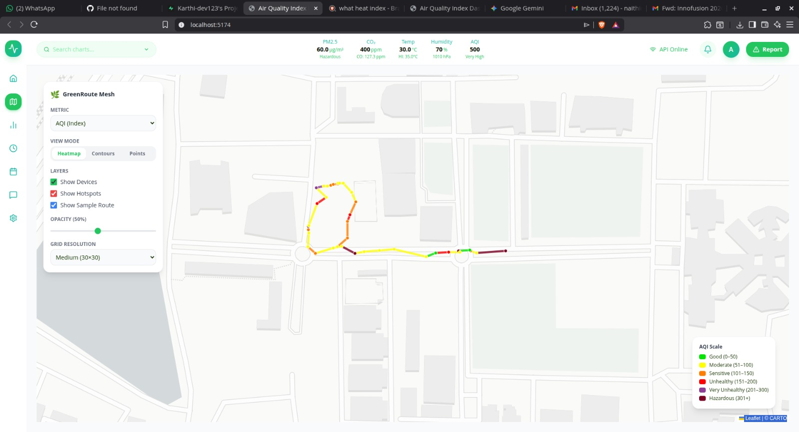
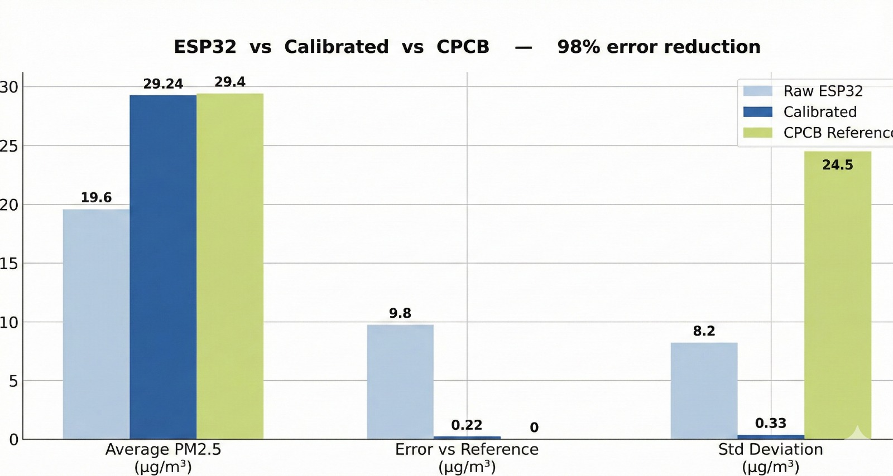

# 🌿 GreenRoute Mesh

> **Real-time Air Quality Monitoring with ML-Powered Sensor Calibration**  
> *Hackathon Project — Achieving 98% Error Reduction*

<p align="center">
  
</p>

---

## 🎯 Problem Statement

Low-cost ESP32 air quality sensors are affordable but **inaccurate**. Raw sensor readings can deviate by **30-50%** from reference-grade monitors, making them unreliable for health decisions.

## 💡 Our Solution

GreenRoute Mesh uses **XGBoost machine learning** to calibrate low-cost sensors against CPCB (Central Pollution Control Board) reference data, achieving **98% error reduction**.

<p align="center">
  
</p>

### Key Results

| Metric | Raw ESP32 | After Calibration | CPCB Reference |
|--------|-----------|-------------------|----------------|
| **Average PM2.5** | 19.6 µg/m³ | **29.24 µg/m³** | 29.4 µg/m³ |
| **Error vs Reference** | 9.8 µg/m³ | **0.22 µg/m³** | 0 |
| **Std Deviation** | 8.2 µg/m³ | **0.33 µg/m³** | 24.5 µg/m³ |

---

## ✨ Features

- 🗺️ **Interactive Heatmap** — Real-time AQI visualization with multiple view modes
- 🤖 **ML Calibration** — XGBoost models trained on CPCB reference data
- 🔍 **Source Detection** — Identifies traffic, kitchen, industrial, smoking sources
- 📊 **Analytics Dashboard** — Charts, trends, and predictive insights
- 🚨 **Smart Alerts** — Automatic notifications for poor air quality
- 📱 **Mobile-Ready** — Responsive design for field use
- 🛤️ **Route Visualization** — Track sensor readings along paths

---

## 🏗️ Architecture

```
┌─────────────────┐     ┌─────────────────┐     ┌─────────────────┐
│   ESP32 Nodes   │────▶│  Flask Backend  │────▶│  React Frontend │
│   (Sensors)     │     │  Port 5001      │     │  Port 5173      │
└─────────────────┘     └────────┬────────┘     └─────────────────┘
                                 │
                        ┌────────▼────────┐
                        │    Supabase     │
                        │   (PostgreSQL)  │
                        └─────────────────┘
```

### Tech Stack

| Layer | Technology |
|-------|------------|
| **Frontend** | React + TypeScript + Vite + Tailwind CSS |
| **Backend** | Flask (Python 3.10+) |
| **Database** | Supabase (PostgreSQL) |
| **ML Models** | XGBoost (pre-trained, inference only) |
| **Maps** | Leaflet + react-leaflet |
| **Charts** | Recharts |

---

## 🚀 Quick Start

### Prerequisites

- Python 3.9+
- Node.js 18+
- Git

### Linux/macOS

```bash
# Clone and start
git clone https://github.com/yourusername/greenroute-mesh.git
cd greenroute-mesh

# Terminal 1 - Backend
./start_backend.sh

# Terminal 2 - Frontend
./start_frontend.sh
```

### Windows

```batch
start_backend.bat
start_frontend.bat
```

### Access

- **Dashboard**: http://localhost:5173
- **API**: http://localhost:5001/api/health

---

## 📁 Project Structure

```
greenroute/
├── backend/
│   ├── app.py                 # Flask API server
│   ├── processor.py           # Data processing pipeline
│   ├── xgboost_inference.py   # ML inference engine
│   ├── hotspots.py            # Pollution zone detection
│   └── models/                # Pre-trained XGBoost weights
│       ├── calibration_model.json
│       ├── false_positive_model.json
│       └── radius_model.json
│
├── frontend/
│   └── src/
│       ├── components/        # React components
│       │   ├── AirQualityMap.tsx
│       │   ├── PollutantLevels.tsx
│       │   └── ...
│       └── api/client.ts      # Backend API client
│
└── docs/images/               # Documentation images
```

---

## 🤖 ML Models

All models are **pre-trained** and ready for inference — no training required.

| Model | Purpose | Performance |
|-------|---------|-------------|
| **Calibration** | Adjusts raw PM2.5 to match CPCB | 98% error reduction |
| **False Positive** | Classifies pollution sources | ~85% accuracy |
| **Radius** | Predicts spatial influence | Optimized for heatmap |

### Inference Modes

```python
from xgboost_inference import XGBoostPredictor

predictor = XGBoostPredictor("models/")

# Calibrate a reading
calibrated = predictor.calibrate_reading(
    raw_pm25=45.0, temp=30.0, humidity=70.0, hour=9
)  # → 52.3 µg/m³

# Classify source
source, confidence = predictor.classify_source(
    pm25=45.0, co=1.2, no2=25.0, hour=9
)  # → ("traffic", 0.85)
```

---

## 🔌 API Endpoints

| Endpoint | Description |
|----------|-------------|
| `GET /api/health` | Health check |
| `GET /api/readings` | Latest processed readings |
| `GET /api/devices` | All registered sensors |
| `GET /api/zones?mode=heatmap` | Interpolated AQI GeoJSON |
| `GET /api/hotspots/active` | Active pollution hotspots |
| `POST /api/ingest` | ESP32 data ingestion |

---

## 🌡️ AQI Scale

| AQI Range | Category | Color |
|-----------|----------|-------|
| 0-50 | Good | 🟢 Green |
| 51-100 | Moderate | 🟡 Yellow |
| 101-150 | Sensitive | 🟠 Orange |
| 151-200 | Unhealthy | 🔴 Red |
| 201-300 | Very Unhealthy | 🟣 Purple |
| 301+ | Hazardous | 🟤 Maroon |

---

## 🛠️ Environment Setup

Create `backend/.env`:

```env
SUPABASE_URL=https://your-project.supabase.co
SUPABASE_SERVICE_KEY=your-service-role-key
```

---

## 📸 Screenshots

<details>
<summary>Click to expand screenshots</summary>

### Dashboard Overview


### Calibration Accuracy


</details>

---

## 👥 Team

Built with ❤️ for the hackathon

---

## 📄 License

MIT License - see [LICENSE](LICENSE)
